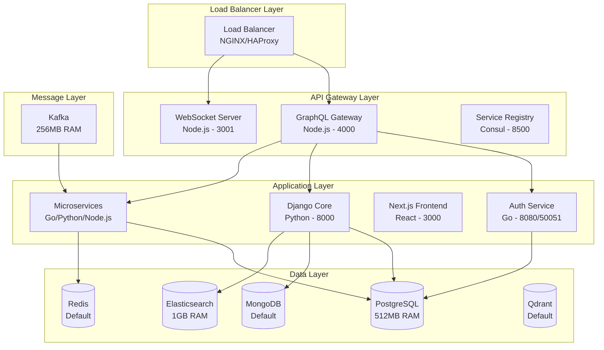
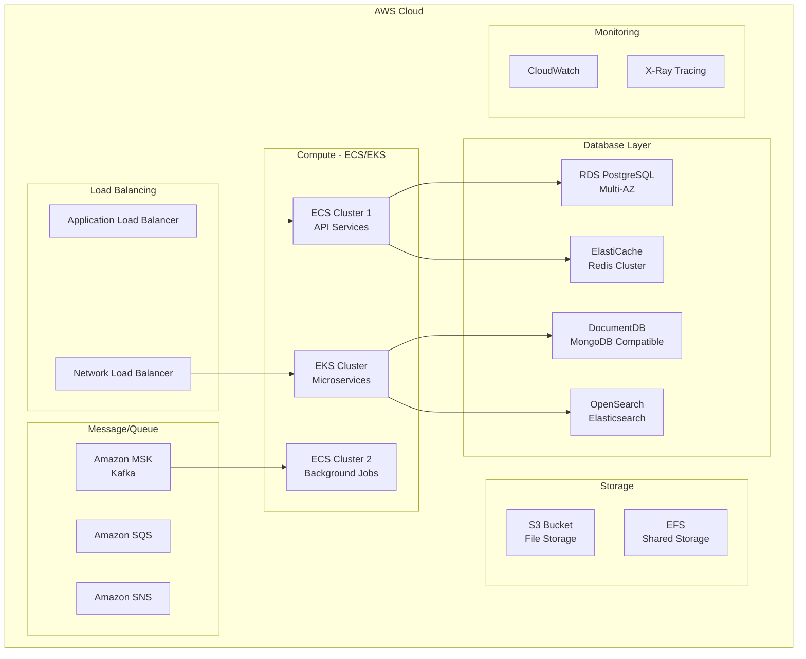

# ERP Suite Infrastructure Analysis

## Executive Summary

This document provides a comprehensive analysis of the ERP Suite infrastructure, including load capacity, traffic handling capabilities, system requirements, performance bottlenecks, and scaling strategies.

## Current Infrastructure Overview

### Architecture Components



## Current Resource Allocation

### Memory Allocation Analysis

| Service | Current Memory | CPU Limit | Bottleneck Risk |
|---------|---------------|-----------|-----------------|
| PostgreSQL | 512MB (limit) / 256MB (reserved) | 1.0 CPU | **HIGH** |
| Elasticsearch | 1GB (limit) / 512MB (reserved) | 1.0 CPU | **MEDIUM** |
| Kafka | 256MB (heap) | No limit | **HIGH** |
| MongoDB | No limit | No limit | **MEDIUM** |
| Redis | No limit | No limit | **LOW** |
| Qdrant | No limit | No limit | **LOW** |
| GraphQL Gateway | No limit | No limit | **MEDIUM** |
| WebSocket Server | No limit | No limit | **MEDIUM** |

### Total Resource Requirements (Current)

- **Minimum RAM**: ~2.5GB
- **Recommended RAM**: ~4GB
- **CPU Cores**: 4+ cores recommended
- **Storage**: 20GB+ for data persistence
- **Network**: 1Gbps for optimal performance

## Load Capacity Analysis

### Current Capacity Estimates

#### Database Layer Capacity

**PostgreSQL (512MB RAM)**
- **Concurrent Connections**: ~100-200
- **Transactions per Second**: ~500-1,000 TPS
- **Data Size**: ~10GB efficiently
- **Bottleneck**: Memory allocation too low for production

**MongoDB (No limits)**
- **Concurrent Connections**: ~1,000+
- **Operations per Second**: ~5,000-10,000 OPS
- **Data Size**: Limited by available disk space
- **Bottleneck**: No resource limits may cause memory issues

**Redis (No limits)**
- **Concurrent Connections**: ~10,000+
- **Operations per Second**: ~100,000+ OPS
- **Memory Usage**: Limited by available system memory
- **Bottleneck**: No memory limits in high-load scenarios

**Elasticsearch (1GB RAM)**
- **Documents**: ~1-5 million documents
- **Search Queries**: ~100-500 queries/second
- **Index Size**: ~5-10GB efficiently
- **Bottleneck**: Memory allocation for large datasets

#### Application Layer Capacity

**GraphQL Gateway (Node.js)**
- **Concurrent Requests**: ~1,000-2,000 req/sec
- **WebSocket Connections**: ~5,000-10,000 concurrent
- **Memory Usage**: ~200-500MB under load
- **Bottleneck**: Single instance, no clustering

**Auth Service (Go)**
- **Authentication Requests**: ~2,000-5,000 req/sec
- **JWT Operations**: ~10,000+ operations/sec
- **Memory Usage**: ~50-100MB
- **Bottleneck**: Database connection pool

**Django Core (Python)**
- **HTTP Requests**: ~500-1,000 req/sec
- **Database Queries**: Limited by PostgreSQL capacity
- **Memory Usage**: ~100-300MB
- **Bottleneck**: Python GIL and database connections

#### Message Layer Capacity

**Kafka (256MB heap)**
- **Messages per Second**: ~10,000-50,000 msg/sec
- **Partitions**: Limited by memory allocation
- **Retention**: 24 hours (current config)
- **Bottleneck**: Low memory allocation for high throughput

### Traffic Handling Estimates

#### Low Load Scenario
- **Concurrent Users**: 50-100
- **Requests per Second**: 500-1,000
- **Database Connections**: 50-100
- **Memory Usage**: 2-3GB
- **Status**: ✅ **Current infrastructure adequate**

#### Medium Load Scenario
- **Concurrent Users**: 500-1,000
- **Requests per Second**: 2,000-5,000
- **Database Connections**: 200-500
- **Memory Usage**: 4-6GB
- **Status**: ⚠️ **Requires optimization**

#### High Load Scenario
- **Concurrent Users**: 2,000-5,000
- **Requests per Second**: 10,000-20,000
- **Database Connections**: 1,000+
- **Memory Usage**: 8-16GB
- **Status**: ❌ **Requires significant scaling**

## Performance Bottlenecks

### Critical Bottlenecks

1. **PostgreSQL Memory Limitation**
   - Current: 512MB limit
   - Impact: Connection pool exhaustion, slow queries
   - Priority: **CRITICAL**

2. **Kafka Memory Allocation**
   - Current: 256MB heap
   - Impact: Message throughput limitations
   - Priority: **HIGH**

3. **Single Instance Services**
   - GraphQL Gateway, WebSocket Server
   - Impact: Single point of failure
   - Priority: **HIGH**

4. **No Load Balancing**
   - All services single instance
   - Impact: No horizontal scaling
   - Priority: **MEDIUM**

### Secondary Bottlenecks

1. **No Connection Pooling**
   - Database connections not optimized
   - Impact: Resource waste, connection limits
   - Priority: **MEDIUM**

2. **No Caching Strategy**
   - Limited Redis utilization
   - Impact: Repeated database queries
   - Priority: **MEDIUM**

3. **No CDN Integration**
   - Static assets served directly
   - Impact: Bandwidth and latency
   - Priority: **LOW**

## System Requirements

### Development Environment

**Minimum Requirements:**
- **RAM**: 4GB
- **CPU**: 2 cores
- **Storage**: 20GB SSD
- **Network**: 100Mbps

**Recommended Requirements:**
- **RAM**: 8GB
- **CPU**: 4 cores
- **Storage**: 50GB SSD
- **Network**: 1Gbps

### Production Environment

**Small Production (100-500 users):**
- **RAM**: 16GB
- **CPU**: 8 cores
- **Storage**: 100GB SSD
- **Network**: 1Gbps
- **Instances**: 2-3 servers

**Medium Production (500-2000 users):**
- **RAM**: 32GB per server
- **CPU**: 16 cores per server
- **Storage**: 500GB SSD
- **Network**: 10Gbps
- **Instances**: 5-10 servers

**Large Production (2000+ users):**
- **RAM**: 64GB+ per server
- **CPU**: 32+ cores per server
- **Storage**: 1TB+ SSD
- **Network**: 10Gbps+
- **Instances**: 20+ servers

## Scaling Strategies

### Immediate Optimizations (Phase 1)

#### Resource Allocation Improvements

```yaml
# Enhanced PostgreSQL Configuration
postgres:
  deploy:
    resources:
      limits:
        memory: 2G
        cpus: '2.0'
      reservations:
        memory: 1G
        cpus: '1.0'
  environment:
    - POSTGRES_SHARED_BUFFERS=512MB
    - POSTGRES_EFFECTIVE_CACHE_SIZE=1536MB
    - POSTGRES_MAX_CONNECTIONS=200
```

```yaml
# Enhanced Kafka Configuration
kafka:
  environment:
    KAFKA_HEAP_OPTS: "-Xmx1g -Xms1g"
    KAFKA_NUM_PARTITIONS: 3
    KAFKA_DEFAULT_REPLICATION_FACTOR: 2
  deploy:
    resources:
      limits:
        memory: 2G
        cpus: '2.0'
```

```yaml
# Enhanced Elasticsearch Configuration
elasticsearch:
  environment:
    ES_JAVA_OPTS: "-Xms2g -Xmx2g"
  deploy:
    resources:
      limits:
        memory: 4G
        cpus: '2.0'
```

#### Connection Pooling

```yaml
# PostgreSQL Connection Pooling with PgBouncer
pgbouncer:
  image: pgbouncer/pgbouncer:latest
  environment:
    DATABASES_HOST: postgres
    DATABASES_PORT: 5432
    DATABASES_USER: postgres
    DATABASES_PASSWORD: postgres
    DATABASES_DBNAME: erp_system
    POOL_MODE: transaction
    MAX_CLIENT_CONN: 1000
    DEFAULT_POOL_SIZE: 25
```

### Horizontal Scaling (Phase 2)

#### Load Balancer Implementation

```yaml
# NGINX Load Balancer
nginx-lb:
  image: nginx:alpine
  ports:
    - "80:80"
    - "443:443"
  volumes:
    - ./nginx/nginx.conf:/etc/nginx/nginx.conf
  depends_on:
    - graphql-gateway-1
    - graphql-gateway-2
    - graphql-gateway-3
```

```nginx
# NGINX Configuration
upstream graphql_backend {
    least_conn;
    server graphql-gateway-1:4000;
    server graphql-gateway-2:4000;
    server graphql-gateway-3:4000;
}

upstream websocket_backend {
    ip_hash;  # Sticky sessions for WebSocket
    server websocket-server-1:3001;
    server websocket-server-2:3001;
}
```

#### Service Replication

```yaml
# Multiple GraphQL Gateway Instances
graphql-gateway-1:
  <<: *graphql-gateway-template
  container_name: erp-suite-graphql-gateway-1

graphql-gateway-2:
  <<: *graphql-gateway-template
  container_name: erp-suite-graphql-gateway-2

graphql-gateway-3:
  <<: *graphql-gateway-template
  container_name: erp-suite-graphql-gateway-3
```

### Database Scaling (Phase 3)

#### PostgreSQL Scaling Options

**Option 1: Read Replicas**
```yaml
postgres-master:
  image: postgres:15-alpine
  environment:
    POSTGRES_REPLICATION_MODE: master
    POSTGRES_REPLICATION_USER: replicator
    POSTGRES_REPLICATION_PASSWORD: replicator_password

postgres-slave-1:
  image: postgres:15-alpine
  environment:
    POSTGRES_REPLICATION_MODE: slave
    POSTGRES_MASTER_HOST: postgres-master
    POSTGRES_REPLICATION_USER: replicator
    POSTGRES_REPLICATION_PASSWORD: replicator_password
```

**Option 2: Database Sharding**
```yaml
# Shard by tenant/organization
postgres-shard-1:  # Organizations 1-1000
postgres-shard-2:  # Organizations 1001-2000
postgres-shard-3:  # Organizations 2001-3000
```

#### MongoDB Scaling
```yaml
# MongoDB Replica Set
mongodb-primary:
  command: mongod --replSet rs0 --bind_ip_all

mongodb-secondary-1:
  command: mongod --replSet rs0 --bind_ip_all

mongodb-secondary-2:
  command: mongod --replSet rs0 --bind_ip_all
```

#### Redis Scaling
```yaml
# Redis Cluster
redis-cluster:
  image: redis:7-alpine
  command: redis-cli --cluster create redis-1:6379 redis-2:6379 redis-3:6379 --cluster-replicas 1
```

### Microservices Scaling (Phase 4)

#### Auto-scaling Configuration

```yaml
# Docker Swarm Auto-scaling
version: '3.8'
services:
  auth-service:
    deploy:
      replicas: 3
      update_config:
        parallelism: 1
        delay: 10s
      restart_policy:
        condition: on-failure
      resources:
        limits:
          memory: 512M
        reservations:
          memory: 256M
```

#### Kubernetes Deployment

```yaml
# Kubernetes HPA (Horizontal Pod Autoscaler)
apiVersion: autoscaling/v2
kind: HorizontalPodAutoscaler
metadata:
  name: auth-service-hpa
spec:
  scaleTargetRef:
    apiVersion: apps/v1
    kind: Deployment
    name: auth-service
  minReplicas: 2
  maxReplicas: 10
  metrics:
  - type: Resource
    resource:
      name: cpu
      target:
        type: Utilization
        averageUtilization: 70
  - type: Resource
    resource:
      name: memory
      target:
        type: Utilization
        averageUtilization: 80
```

## Cloud Scaling Architecture

### AWS Architecture



### Resource Scaling Recommendations

#### Small Scale (100-500 users)
```yaml
# AWS ECS Configuration
Task Definition:
  CPU: 1024 (1 vCPU)
  Memory: 2048 MB
  Desired Count: 2-3

RDS Instance:
  Instance Class: db.t3.medium
  Storage: 100GB GP2
  Multi-AZ: true

ElastiCache:
  Node Type: cache.t3.micro
  Nodes: 2

OpenSearch:
  Instance Type: t3.small.search
  Instances: 2
```

#### Medium Scale (500-2000 users)
```yaml
# AWS ECS Configuration
Task Definition:
  CPU: 2048 (2 vCPU)
  Memory: 4096 MB
  Desired Count: 5-10

RDS Instance:
  Instance Class: db.r5.xlarge
  Storage: 500GB GP3
  Multi-AZ: true
  Read Replicas: 2

ElastiCache:
  Node Type: cache.r5.large
  Nodes: 3
  Cluster Mode: enabled

OpenSearch:
  Instance Type: r5.large.search
  Instances: 3
  Master Nodes: 3
```

#### Large Scale (2000+ users)
```yaml
# AWS EKS Configuration
Node Groups:
  - Name: api-services
    Instance Type: c5.2xlarge
    Min Size: 3
    Max Size: 20
    Desired: 5
  
  - Name: background-jobs
    Instance Type: m5.xlarge
    Min Size: 2
    Max Size: 10
    Desired: 3

RDS Instance:
  Instance Class: db.r5.4xlarge
  Storage: 1TB GP3
  Multi-AZ: true
  Read Replicas: 5

ElastiCache:
  Node Type: cache.r5.2xlarge
  Nodes: 6
  Cluster Mode: enabled
  Shards: 3

OpenSearch:
  Instance Type: r5.2xlarge.search
  Instances: 6
  Master Nodes: 3
  Dedicated Master: true
```

## Performance Monitoring

### Key Metrics to Monitor

#### Infrastructure Metrics
- **CPU Utilization**: Target < 70%
- **Memory Usage**: Target < 80%
- **Disk I/O**: Monitor IOPS and latency
- **Network Throughput**: Monitor bandwidth usage

#### Application Metrics
- **Response Time**: Target < 200ms (95th percentile)
- **Throughput**: Requests per second
- **Error Rate**: Target < 1%
- **Availability**: Target > 99.9%

#### Database Metrics
- **Connection Pool Usage**: Target < 80%
- **Query Performance**: Slow query monitoring
- **Replication Lag**: Target < 1 second
- **Cache Hit Ratio**: Target > 90%

### Monitoring Stack

```yaml
# Prometheus + Grafana Monitoring
prometheus:
  image: prom/prometheus:latest
  ports:
    - "9090:9090"
  volumes:
    - ./prometheus.yml:/etc/prometheus/prometheus.yml

grafana:
  image: grafana/grafana:latest
  ports:
    - "3000:3000"
  environment:
    GF_SECURITY_ADMIN_PASSWORD: admin

# Application Performance Monitoring
jaeger:
  image: jaegertracing/all-in-one:latest
  ports:
    - "16686:16686"
    - "14268:14268"

# Log Aggregation
fluentd:
  image: fluent/fluentd:latest
  volumes:
    - ./fluentd.conf:/fluentd/etc/fluent.conf
```

## Cost Optimization

### Development Environment Costs
- **Local Development**: $0 (using local Docker)
- **Cloud Development**: $200-500/month
- **Staging Environment**: $500-1000/month

### Production Environment Costs

#### Small Production (AWS)
- **Compute (ECS)**: $200-400/month
- **Database (RDS)**: $300-500/month
- **Cache (ElastiCache)**: $100-200/month
- **Load Balancer**: $25/month
- **Storage**: $50-100/month
- **Total**: ~$675-1225/month

#### Medium Production (AWS)
- **Compute (EKS)**: $800-1500/month
- **Database (RDS)**: $1000-2000/month
- **Cache (ElastiCache)**: $400-600/month
- **Load Balancer**: $50/month
- **Storage**: $200-400/month
- **Total**: ~$2450-4550/month

#### Large Production (AWS)
- **Compute (EKS)**: $3000-6000/month
- **Database (RDS)**: $4000-8000/month
- **Cache (ElastiCache)**: $1500-3000/month
- **Load Balancer**: $100/month
- **Storage**: $1000-2000/month
- **Total**: ~$9600-19100/month

## Disaster Recovery

### Backup Strategy

```yaml
# Automated Backup Configuration
postgres-backup:
  image: postgres:15-alpine
  command: |
    sh -c "
    while true; do
      pg_dump -h postgres -U postgres erp_system > /backup/erp_system_$(date +%Y%m%d_%H%M%S).sql
      aws s3 cp /backup/ s3://erp-backups/ --recursive
      find /backup -name '*.sql' -mtime +7 -delete
      sleep 86400
    done"
  volumes:
    - backup_data:/backup

mongodb-backup:
  image: mongo:6-jammy
  command: |
    sh -c "
    while true; do
      mongodump --host mongodb --out /backup/mongodb_$(date +%Y%m%d_%H%M%S)
      aws s3 cp /backup/ s3://erp-backups/mongodb/ --recursive
      find /backup -name 'mongodb_*' -mtime +7 -exec rm -rf {} \;
      sleep 86400
    done"
  volumes:
    - backup_data:/backup
```

### High Availability Setup

```yaml
# Multi-Region Deployment
version: '3.8'
services:
  postgres-primary:
    image: postgres:15-alpine
    environment:
      POSTGRES_REPLICATION_MODE: master
    volumes:
      - postgres_primary:/var/lib/postgresql/data

  postgres-standby:
    image: postgres:15-alpine
    environment:
      POSTGRES_REPLICATION_MODE: slave
      POSTGRES_MASTER_HOST: postgres-primary
    volumes:
      - postgres_standby:/var/lib/postgresql/data
```

## Security Considerations

### Network Security
- **VPC Configuration**: Isolated network segments
- **Security Groups**: Restrictive inbound/outbound rules
- **WAF**: Web Application Firewall for API protection
- **DDoS Protection**: CloudFlare or AWS Shield

### Data Security
- **Encryption at Rest**: All databases encrypted
- **Encryption in Transit**: TLS 1.3 for all communications
- **Key Management**: AWS KMS or HashiCorp Vault
- **Access Control**: IAM roles and policies

### Application Security
- **JWT Token Security**: Short expiration, refresh tokens
- **Rate Limiting**: API rate limiting per user/IP
- **Input Validation**: Comprehensive input sanitization
- **Audit Logging**: All user actions logged

## Conclusion

The current ERP Suite infrastructure is suitable for development and small-scale production deployments (up to 500 concurrent users). For larger deployments, significant scaling improvements are required, particularly in:

1. **Database layer optimization** (memory allocation, connection pooling)
2. **Horizontal scaling** (load balancing, service replication)
3. **Caching strategy** (Redis utilization, CDN integration)
4. **Monitoring and observability** (metrics, logging, tracing)

The provided scaling strategies offer a clear path from the current single-server setup to a highly available, multi-region cloud deployment capable of handling enterprise-scale workloads.

### Next Steps

1. **Immediate**: Implement Phase 1 optimizations (resource allocation)
2. **Short-term**: Deploy Phase 2 horizontal scaling (load balancing)
3. **Medium-term**: Implement Phase 3 database scaling (read replicas)
4. **Long-term**: Migrate to cloud-native architecture (Kubernetes, managed services)

This analysis provides the foundation for making informed decisions about infrastructure scaling based on actual usage patterns and growth requirements.