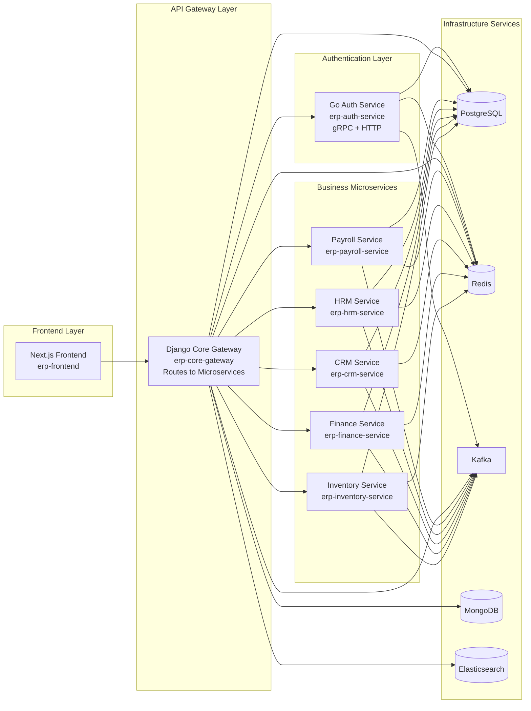

# ERP Suite Infrastructure
## 🛠 Tech Stack


This directory contains the infrastructure setup for the ERP Suite development environment, providing all databases and services as Docker containers.

## 🏗️ ERP System Infrastructure Integration Hierarchy

The infrastructure services form the foundation layer that supports the entire multi-tenant ERP system with AI enhancements. Below is the complete integration hierarchy:

```mermaid
graph TB
    subgraph Client["🌐 Client Layer"]
        WEB[Next.js/React Frontend]
        MOBILE[Mobile App]
        API_CLIENTS[External API Clients]
    end
    
    subgraph Gateway["🚪 Gateway & Security Layer"]
        API_GATEWAY[API Gateway - Kong/Nginx]
        AUTH_PROXY[Authentication Proxy]
        RATE_LIMITER[Rate Limiter]
        LOAD_BALANCER[Load Balancer]
    end
    
    subgraph AI["🤖 AI Enhancement Layer"]
        AI_GATEWAY[AI Gateway Service - FastAPI]
        RAG_ENGINE[RAG Engine - Python]
        CONTEXT_MANAGER[Context Manager]
        EMBEDDING_SERVICE[Embedding Service]
    end
    
    subgraph SaaS["💼 SaaS Foundation Layer"]
        SUBSCRIPTION[Subscription Service - Django]
        BILLING[Billing Service - Django]
        FEATURE_GATE[Feature Gating Service]
        USAGE_TRACKER[Usage Tracking Service]
        PAYMENT_PROCESSOR[Payment Processing]
    end
    
    subgraph Security["🔐 Core Security Layer"]
        AUTH_SERVICE[Authentication Service - Django]
        TENANT_SERVICE[Tenant Management - Django]
        RBAC_SERVICE[RBAC Service - Django]
        USER_MGMT[User Management]
    end
    
    subgraph Business["📊 Business Services Layer"]
        HRM[HRM Service - Django]
        CRM[CRM Service - Django]
        FINANCE[Finance Service - Django]
        INVENTORY[Inventory Service - Django]
        PROJECTS[Project Service - Django]
        ANALYTICS[Analytics Service - Django]
    end
    
    subgraph Microservices["⚡ Microservices Layer"]
        INVOICE_GEN[Invoice Generator - Go]
        REPORT_GEN[Report Generator - Go]
        EMAIL_SERVICE[Email Service - Go]
        FILE_PROCESSOR[File Processing - Go]
        SEARCH_SERVICE[Search Service - Go]
        NOTIFICATION[Notification Service - Go]
    end
    
    subgraph Infrastructure["🏗️ Infrastructure Services"]
        POSTGRES[(PostgreSQL 15+)]
        MONGODB[(MongoDB 6+)]
        REDIS[(Redis 7+)]
        QDRANT[(Qdrant Vector DB)]
        KAFKA[Apache Kafka 3.5+]
        ZOOKEEPER[Zookeeper]
        ELASTICSEARCH[(Elasticsearch 8+)]
        KIBANA[Kibana]
        PROMETHEUS[Prometheus]
        GRAFANA[Grafana]
        JAEGER[Jaeger]
        PGADMIN[pgAdmin]
        MONGO_EXPRESS[Mongo Express]
        REDIS_COMMANDER[Redis Commander]
        KAFKA_UI[Kafka UI]
        WEBSOCKET[WebSocket Server]
    end
    
    subgraph External["☁️ External Integrations"]
        GOOGLE_SERVICES[Google Services]
        PAYMENT_GATEWAYS[Payment Gateways]
        LLM_PROVIDERS[LLM Providers]
        CLOUD_STORAGE[Cloud Storage]
    end
    
    subgraph Container["🐳 Container Orchestration"]
        DOCKER[Docker Containers]
        KUBERNETES[Kubernetes Production]
        HELM[Helm Charts]
    end

    %% Client connections
    WEB --> API_GATEWAY
    MOBILE --> API_GATEWAY
    API_CLIENTS --> API_GATEWAY
    
    %% Gateway layer
    API_GATEWAY --> AUTH_PROXY
    AUTH_PROXY --> RATE_LIMITER
    RATE_LIMITER --> LOAD_BALANCER
    
    %% Core authentication flow
    LOAD_BALANCER --> AUTH_SERVICE
    AUTH_SERVICE --> TENANT_SERVICE
    TENANT_SERVICE --> RBAC_SERVICE
    
    %% SaaS foundation integration
    AUTH_SERVICE --> SUBSCRIPTION
    SUBSCRIPTION --> BILLING
    SUBSCRIPTION --> FEATURE_GATE
    BILLING --> PAYMENT_PROCESSOR
    
    %% Business services access control
    FEATURE_GATE --> HRM
    FEATURE_GATE --> CRM
    FEATURE_GATE --> FINANCE
    FEATURE_GATE --> INVENTORY
    FEATURE_GATE --> PROJECTS
    FEATURE_GATE --> ANALYTICS
    
    %% AI layer integration
    LOAD_BALANCER --> AI_GATEWAY
    AI_GATEWAY --> RAG_ENGINE
    RAG_ENGINE --> CONTEXT_MANAGER
    RAG_ENGINE --> EMBEDDING_SERVICE
    
    %% Business services to microservices
    HRM --> INVOICE_GEN
    FINANCE --> REPORT_GEN
    CRM --> EMAIL_SERVICE
    INVENTORY --> FILE_PROCESSOR
    PROJECTS --> SEARCH_SERVICE
    ANALYTICS --> NOTIFICATION
    
    %% Database connections
    AUTH_SERVICE --> POSTGRES
    TENANT_SERVICE --> POSTGRES
    HRM --> POSTGRES
    CRM --> POSTGRES
    FINANCE --> POSTGRES
    INVENTORY --> POSTGRES
    PROJECTS --> POSTGRES
    SUBSCRIPTION --> POSTGRES
    BILLING --> POSTGRES
    
    ANALYTICS --> MONGODB
    EMAIL_SERVICE --> MONGODB
    REPORT_GEN --> MONGODB
    
    AUTH_SERVICE --> REDIS
    TENANT_SERVICE --> REDIS
    WEBSOCKET --> REDIS
    
    AI_GATEWAY --> QDRANT
    RAG_ENGINE --> QDRANT
    EMBEDDING_SERVICE --> QDRANT
    
    %% Search integration
    SEARCH_SERVICE --> ELASTICSEARCH
    KIBANA --> ELASTICSEARCH
    
    %% Event streaming
    HRM --> KAFKA
    CRM --> KAFKA
    FINANCE --> KAFKA
    INVENTORY --> KAFKA
    PROJECTS --> KAFKA
    SUBSCRIPTION --> KAFKA
    
    KAFKA --> ZOOKEEPER
    KAFKA --> INVOICE_GEN
    KAFKA --> REPORT_GEN
    KAFKA --> EMAIL_SERVICE
    KAFKA --> NOTIFICATION
    
    %% Real-time communication
    WEBSOCKET --> REDIS
    NOTIFICATION --> WEBSOCKET
    
    %% External integrations
    EMAIL_SERVICE --> GOOGLE_SERVICES
    FILE_PROCESSOR --> GOOGLE_SERVICES
    CRM --> GOOGLE_SERVICES
    PAYMENT_PROCESSOR --> PAYMENT_GATEWAYS
    AI_GATEWAY --> LLM_PROVIDERS
    FILE_PROCESSOR --> CLOUD_STORAGE
    
    %% Monitoring
    PROMETHEUS --> GRAFANA
    JAEGER --> GRAFANA
    
    %% Container orchestration
    DOCKER --> KUBERNETES
    KUBERNETES --> HELM
    
    %% Development tools connections
    PGADMIN --> POSTGRES
    MONGO_EXPRESS --> MONGODB
    REDIS_COMMANDER --> REDIS
    KAFKA_UI --> KAFKA
```



## 🔗 Key Infrastructure Integration Points

### **1. Multi-Tenant Data Flow**
- **Tenant Resolution**: API Gateway → Auth Service → Tenant Service
- **Data Isolation**: PostgreSQL schemas per tenant (`tenant_acme_corp`, `tenant_beta_inc`)
- **Cache Isolation**: Redis namespacing (`tenant:acme-corp:*`)
- **Search Isolation**: Elasticsearch tenant-specific indexes
- **Vector DB Isolation**: Qdrant collections per tenant for AI features

### **2. Event-Driven Architecture**
- **Business Events**: Django services → Kafka → Go microservices
- **Real-time Updates**: Kafka → WebSocket Server → Frontend
- **AI Context Updates**: Business changes → RAG Engine → Vector DB
- **Cross-Service Communication**: Asynchronous event processing

### **3. SaaS Foundation Integration**
- **Feature Gating**: All business services check subscription status before operations
- **Usage Tracking**: Every operation tracked for billing and analytics
- **Payment Processing**: Automated billing cycles with multiple gateway support
- **Subscription Management**: Dynamic feature access based on plans

### **4. AI Enhancement Layer**
- **Contextual AI**: RAG Engine accesses all business data via vector embeddings
- **Action Execution**: AI Gateway can perform CRUD operations across all modules
- **Real-time Context**: AI maintains conversation state in Redis
- **Multi-LLM Support**: Fallback mechanisms between providers

### **5. Infrastructure Services**
- **Development**: Docker Compose orchestrates all services locally
- **Production**: Kubernetes with Helm charts for scalable deployment
- **Monitoring**: Prometheus/Grafana for metrics, Jaeger for distributed tracing
- **Management**: Web UIs for all database and message broker administration

## 📊 Infrastructure Components

### **Core Infrastructure Services**
- **PostgreSQL 15+**: Primary relational database for all business modules
- **MongoDB 6+**: Document database for analytics, logs, and AI conversations
- **Redis 7+**: In-memory cache, session store, and message queues
- **Qdrant 1.7+**: Vector database for AI/RAG functionality
- **Apache Kafka 3.5+**: Event streaming and inter-service communication
- **Elasticsearch 8+**: Full-text search and analytics
- **Prometheus + Grafana**: Monitoring, metrics, and dashboards
- **Jaeger**: Distributed tracing and observability

### **Development Tools**
- **pgAdmin**: PostgreSQL database management
- **Mongo Express**: MongoDB administration interface
- **Redis Commander**: Redis data browser and management
- **Kafka UI**: Kafka cluster management and monitoring
- **Kibana**: Elasticsearch data visualization

### **Shared Configuration System**
The infrastructure includes a comprehensive shared configuration system located in `shared-config/` that provides:
- Environment-specific configurations (development, testing, staging, production)
- Module-specific environment variable generation
- Service discovery and connection management
- Configuration validation and templates
- Multi-language support (Go, Python, Node.js)

## 🚀 Quick Start

### Docker Compose (Development)
```bash
# Start all services
make dev-up

# Start specific service group
make db-up        # Databases only
make monitoring-up # Monitoring stack only
make tools-up     # Development tools only

# Stop all services
make dev-down

# View logs
make logs
```

### Kubernetes (Production-like)
```bash
# Deploy to local Kubernetes
make k8s-deploy

# Port forward services
make k8s-ports

# Clean up
make k8s-clean
```

## 📋 Service Endpoints

| Service | Port | URL | Credentials |
|---------|------|-----|-------------|
| PostgreSQL | 5432 | localhost:5432 | postgres/postgres |
| MongoDB | 27017 | localhost:27017 | root/password |
| Redis | 6379 | localhost:6379 | - |
| Qdrant | 6333 | http://localhost:6333 | - |
| Kafka | 9092 | localhost:9092 | - |
| Elasticsearch | 9200 | http://localhost:9200 | elastic/password |
| Prometheus | 9090 | http://localhost:9090 | - |
| Grafana | 3000 | http://localhost:3000 | admin/admin |
| Jaeger | 16686 | http://localhost:16686 | - |
| pgAdmin | 8081 | http://localhost:8081 | admin@erp.com/admin |
| Mongo Express | 8082 | http://localhost:8082 | admin/pass |
| Redis Commander | 8083 | http://localhost:8083 | - |
| Kafka UI | 8084 | http://localhost:8084 | - |
| Kibana | 5601 | http://localhost:5601 | elastic/password |

## 🔧 Configuration

All services are pre-configured for development with:
- Persistent volumes for data
- Health checks
- Resource limits
- Network isolation
- Security configurations

## 🔄 Incremental Development Support

This infrastructure is **specifically designed** to support module-by-module and microservice incremental development. The core application will run entirely from this infrastructure foundation.

### **✅ Why This Infrastructure Supports Incremental Development**

#### **1. Foundation-First Approach**
- **All core services are ready**: Databases, message brokers, monitoring, and development tools
- **No dependencies on business modules**: Infrastructure runs independently
- **Immediate development capability**: Start coding any module right away

#### **2. Modular Service Architecture**
```bash
# Start with just the infrastructure
make db-up          # Only databases for initial development
make monitoring-up  # Add monitoring when needed
make dev-up         # Full stack when ready
```

#### **3. Independent Module Development**
Each module can be developed independently because:
- **Shared Database Access**: All modules connect to the same PostgreSQL/MongoDB instances
- **Event-Driven Communication**: Modules communicate via Kafka (loose coupling)
- **Service Discovery**: Each module registers and discovers others through the infrastructure
- **Tenant Isolation**: Multi-tenant support built into the infrastructure layer

### **🚀 Development Phases Supported**

#### **Phase 1: Core Foundation (Current)**
```bash
# Infrastructure is ready for:
✅ Authentication Service (Django)
✅ Tenant Management (Django) 
✅ RBAC Service (Django)
✅ Basic Frontend (Next.js)
```

#### **Phase 2: First Business Module**
```bash
# Add your first module (e.g., CRM):
✅ CRM Service connects to PostgreSQL
✅ CRM publishes events to Kafka
✅ CRM uses Redis for caching
✅ CRM integrates with auth services
```

#### **Phase 3: Additional Modules**
```bash
# Each new module follows the same pattern:
✅ HRM Service → PostgreSQL + Kafka + Redis
✅ Finance Service → PostgreSQL + Kafka + Redis  
✅ Inventory Service → PostgreSQL + Kafka + Redis
```

#### **Phase 4: Microservices Layer**
```bash
# Add Go microservices as needed:
✅ Invoice Generator → Consumes Kafka events
✅ Email Service → MongoDB + Kafka
✅ Report Generator → MongoDB + Kafka
```

#### **Phase 5: AI Enhancement (Optional)**
```bash
# AI services when ready:
✅ AI Gateway → Qdrant + Redis
✅ RAG Engine → Qdrant + Elasticsearch
```

### **🛠️ Development Workflow**

#### **Starting a New Module**
```bash
# 1. Infrastructure is already running
make dev-up

# 2. Create your module (e.g., erp-suite/crm-module/)
mkdir erp-suite/crm-module
cd erp-suite/crm-module

# 3. Connect to existing infrastructure
# Database: localhost:5432 (PostgreSQL)
# Cache: localhost:6379 (Redis)  
# Events: localhost:9092 (Kafka)
# Search: localhost:9200 (Elasticsearch)

# 4. Develop your module using the shared infrastructure
# 5. Deploy alongside existing modules
```

#### **Module Integration Pattern**
```python
# Each module follows this pattern:
class CRMService:
    def __init__(self):
        # Connect to shared infrastructure
        self.db = connect_to_postgres()      # Shared database
        self.cache = connect_to_redis()      # Shared cache
        self.events = connect_to_kafka()     # Shared event bus
        self.search = connect_to_elasticsearch()  # Shared search
    
    def create_contact(self, data):
        # 1. Save to database
        contact = self.db.save(data)
        
        # 2. Cache for performance  
        self.cache.set(f"contact:{contact.id}", contact)
        
        # 3. Publish event for other modules
        self.events.publish("crm.contact.created", contact)
        
        # 4. Index for search
        self.search.index("contacts", contact)
        
        return contact
```

### **🔧 Infrastructure Benefits for Development**

#### **1. Zero Infrastructure Setup Time**
- **No database installation**: PostgreSQL, MongoDB, Redis ready
- **No message broker setup**: Kafka + Zookeeper configured
- **No monitoring setup**: Prometheus + Grafana ready
- **No development tools**: pgAdmin, Kafka UI, Redis Commander available

#### **2. Production-Like Development Environment**
- **Same stack as production**: Docker containers mirror production
- **Real services**: Not mocks or stubs
- **Full observability**: Monitoring and tracing from day one
- **Multi-tenant ready**: Tenant isolation built-in

#### **3. Seamless Module Integration**
- **Plug-and-play**: New modules connect to existing infrastructure
- **Event-driven**: Loose coupling between modules
- **Shared resources**: Efficient resource utilization
- **Consistent patterns**: Same connection patterns for all modules

#### **4. Development Team Efficiency**
- **Parallel development**: Teams can work on different modules simultaneously
- **Shared infrastructure**: No duplicate setup across teams
- **Consistent tooling**: Same development tools for all modules
- **Easy debugging**: Centralized logging and monitoring

### **📋 Module Development Checklist**

When developing a new module, you can immediately use:

- ✅ **PostgreSQL** (localhost:5432) - Primary database
- ✅ **MongoDB** (localhost:27017) - Analytics and logs  
- ✅ **Redis** (localhost:6379) - Caching and sessions
- ✅ **Kafka** (localhost:9092) - Event streaming
- ✅ **Elasticsearch** (localhost:9200) - Full-text search
- ✅ **Qdrant** (localhost:6333) - Vector database for AI
- ✅ **WebSocket** (localhost:3001) - Real-time communication

## 🏗️ ERP Ecosystem Architecture

The ERP system follows a microservices architecture where each business module is a separate service/repository, with a unified infrastructure foundation and core services.

### **📁 Repository Structure**
```
erp-ecosystem/
├── erp-infrastructure/          # 🏗️ Infrastructure services (This repo)
├── erp-auth-service/           # 🔐 Authentication & Authorization Service (Go)
├── erp-core-gateway/           # 🚪 Django API Gateway (Routes to microservices)
├── erp-frontend/               # ⚛️ Next.js Frontend Application
├── erp-payroll-service/        # 💰 Payroll Microservice (Separate repo)
├── erp-hrm-service/           # 👥 HRM Microservice (Separate repo)
├── erp-crm-service/           # 📞 CRM Microservice (Separate repo)
├── erp-finance-service/       # 💼 Finance Microservice (Separate repo)
└── erp-inventory-service/     # 📦 Inventory Microservice (Separate repo)
```

### **🎯 Single Command Core Services**

For any developer to start working on a new module, they need all core services running. Use this single command:

```bash
cd erp-infrastructure
make dev-full-stack
```

**This command starts:**
- ✅ All infrastructure services (PostgreSQL, Redis, Kafka, MongoDB, Elasticsearch, etc.)
- ✅ Authentication service (Go - ports 8080/50051)
- ✅ Core API Gateway (Django - port 8000)
- ✅ Frontend application (Next.js - port 3000)
- ✅ All monitoring and development tools
- ✅ Service discovery and networking

### **🔄 Service Communication Flow**


### **🚀 Development Workflow**

#### **Single Command Full Stack Startup**
```bash
cd erp-suite/infrastructure

# Start everything: infrastructure + core application services
make dev-full-stack
```

This single command starts:
- ✅ All infrastructure services (PostgreSQL, Redis, Kafka, MongoDB, Elasticsearch, etc.)
- ✅ Authentication service (Go - ports 8080/50051)
- ✅ Django Core Gateway (port 8000)
- ✅ Next.js Frontend (port 3000)
- ✅ All monitoring and development tools
- ✅ Shared configuration system

#### **Incremental Development Approach**
```bash
# Option 1: Start only infrastructure for module development
make dev-up

# Option 2: Start infrastructure + specific services
make db-up              # Databases only
make monitoring-up      # Monitoring stack
make tools-up          # Development tools

# Option 3: Full stack for complete development
make dev-full-stack    # Everything including core apps
```

#### **Configuration Management**
The infrastructure includes a consolidated shared configuration system:

```bash
# Generate configuration for a specific module
make generate-config MODULE=auth ENV=development

# Generate configurations for all modules
make generate-all-configs

# Validate configuration files
make validate-config

# Show available modules and environments
make show-config-info
```

### **🔧 Service Integration Patterns**

#### **1. Authentication Flow**
```python
# Django Core App - Authentication Middleware
import grpc
from auth_pb2 import ValidateTokenRequest
from auth_pb2_grpc import AuthServiceStub

class AuthMiddleware:
    def __init__(self, get_response):
        self.get_response = get_response
        self.auth_client = self._get_grpc_client()
    
    def _get_grpc_client(self):
        channel = grpc.insecure_channel('localhost:50051')
        return AuthServiceStub(channel)
    
    def __call__(self, request):
        token = request.headers.get('Authorization')
        if token:
            # Validate token via gRPC to auth-module
            response = self.auth_client.ValidateToken(
                ValidateTokenRequest(token=token)
            )
            request.user_context = response.user
        
        return self.get_response(request)
```

#### **2. Module Development Pattern**
```python
# Future modules (CRM, HRM, etc.) as Django apps
# erp-django-core-app/apps/crm/views.py

from rest_framework.views import APIView
from rest_framework.response import Response
from .models import Contact
from .serializers import ContactSerializer

class ContactViewSet(APIView):
    def post(self, request):
        # 1. Validate user permissions (via auth-module)
        # 2. Create contact in PostgreSQL
        # 3. Publish event to Kafka
        # 4. Cache in Redis
        # 5. Index in Elasticsearch
        
        contact = Contact.objects.create(**request.data)
        
        # Publish event
        self.publish_event('crm.contact.created', contact.to_dict())
        
        return Response(ContactSerializer(contact).data)
```

### **🎯 Development Commands**

#### **Infrastructure Management**
```bash
cd erp-suite/infrastructure

# Start all infrastructure services
make dev-up

# Start only databases for initial development
make db-up

# Check service status
make status

# View logs for debugging
make logs
make logs-postgres           # Specific service logs
make logs-kafka

# Clean up when needed
make dev-down
make clean                   # Full cleanup
```

#### **Infrastructure-Centric Development (Unified Approach)**
```bash
# All services orchestrated from infrastructure directory
cd erp-suite/infrastructure

# Start infrastructure + all application services (UNIFIED)
make dev-up-full

# Or start infrastructure first, then add applications
make dev-up                    # Infrastructure only
make app-up                    # Add application services

# Individual service management (all from infrastructure)
make auth-up                   # Auth service only
make django-up                 # Django core only
make frontend-up               # Frontend only

# All services use the same network and infrastructure
# No separate docker-compose files needed per module
```

### **📊 Service Endpoints**

| Service | Port | Purpose | Access |
|---------|------|---------|---------|
| **Infrastructure** | | | |
| PostgreSQL | 5432 | Primary database | All services |
| Redis | 6379 | Cache & sessions | All services |
| Kafka | 9092 | Event streaming | All services |
| MongoDB | 27017 | Analytics & logs | Django Core |
| Elasticsearch | 9200 | Search & indexing | Django Core |
| **Application Services** | | | |
| Auth Module (HTTP) | 8080 | Auth REST API | Django Core |
| Auth Module (gRPC) | 50051 | Auth gRPC API | Django Core |
| Django Core App | 8000 | Main API Gateway | Frontend |
| Next.js Frontend | 3000 | Web Application | Users |

### **🔄 Adding New Modules**

When adding new ERP modules (CRM, HRM, Finance, etc.):

1. **Create Django App** in `erp-django-core-app/apps/`
2. **Connect to Infrastructure** (PostgreSQL, Redis, Kafka, Elasticsearch)
3. **Use Auth Module** via gRPC for authentication/authorization
4. **Publish Events** to Kafka for inter-module communication
5. **Frontend Integration** via Django Core App APIs

This architecture provides:
- ✅ **Centralized API Gateway** (Django Core App)
- ✅ **Dedicated Auth Service** (Go Auth Module)
- ✅ **Modern Frontend** (Next.js)
- ✅ **Shared Infrastructure** (All services use same databases/brokers)
- ✅ **Event-Driven Communication** (Kafka for loose coupling)
- ✅ **Multi-tenant Support** (Built into infrastructure)
- ✅ **Incremental Development** (Add modules as Django apps)

### **📚 Module Connection Examples**

Each ERP module connects to this infrastructure using standard connection strings and configurations:

```python
# Django settings.py example
DATABASES = {
    'default': {
        'ENGINE': 'django.db.backends.postgresql',
        'HOST': 'localhost',
        'PORT': '5432',
        'NAME': 'erp_crm',  # Module-specific database
        'USER': 'postgres',
        'PASSWORD': 'postgres',
    }
}

CACHES = {
    'default': {
        'BACKEND': 'django_redis.cache.RedisCache',
        'LOCATION': 'redis://localhost:6379/1',
    }
}

# Kafka configuration
KAFKA_BOOTSTRAP_SERVERS = ['localhost:9092']
```

## 🐳 Unified Docker Development Environment

For the complete containerized development experience, create a unified Docker Compose setup:

### **Unified Infrastructure-Based Docker Compose**
**ALL modules run from the infrastructure directory - no separate docker-compose files needed per module.**

```yaml
# erp-suite/infrastructure/docker-compose.yml (UPDATED)
version: '3.8'

services:
  # ============================================================================
  # INFRASTRUCTURE SERVICES (Existing)
  # ============================================================================
  postgres:
    image: postgres:15-alpine
    container_name: erp-postgres
    environment:
      POSTGRES_DB: erp_system
      POSTGRES_USER: postgres
      POSTGRES_PASSWORD: postgres
      POSTGRES_MULTIPLE_DATABASES: erp_auth,erp_core,erp_crm,erp_hrm,erp_finance,erp_inventory,erp_projects
    ports:
      - "5432:5432"
    volumes:
      - postgres_data:/var/lib/postgresql/data
      - ./scripts/postgres-init.sh:/docker-entrypoint-initdb.d/postgres-init.sh
    networks:
      - erp-network

  redis:
    image: redis:7-alpine
    container_name: erp-redis
    command: redis-server --appendonly yes --requirepass redispassword
    ports:
      - "6379:6379"
    volumes:
      - redis_data:/data
    networks:
      - erp-network

  kafka:
    image: confluentinc/cp-kafka:7.4.0
    container_name: erp-kafka
    depends_on:
      - zookeeper
    environment:
      KAFKA_BROKER_ID: 1
      KAFKA_ZOOKEEPER_CONNECT: zookeeper:2181
      KAFKA_ADVERTISED_LISTENERS: PLAINTEXT://kafka:29092,PLAINTEXT_HOST://localhost:9092
      KAFKA_LISTENERS: PLAINTEXT://0.0.0.0:29092,PLAINTEXT_HOST://0.0.0.0:9092
      KAFKA_INTER_BROKER_LISTENER_NAME: PLAINTEXT
      KAFKA_OFFSETS_TOPIC_REPLICATION_FACTOR: 1
    ports:
      - "9092:9092"
    volumes:
      - kafka_data:/var/lib/kafka/data
    networks:
      - erp-network

  # ... (other infrastructure services)

  # ============================================================================
  # APPLICATION SERVICES (Added to Infrastructure)
  # ============================================================================
  
  # Go Auth Module
  auth-service:
    build:
      context: ../auth-module
      dockerfile: Dockerfile.dev
    container_name: erp-auth-service
    ports:
      - "8080:8080"
      - "50051:50051"
    environment:
      - DB_HOST=postgres
      - DB_PORT=5432
      - DB_NAME=erp_auth
      - DB_USER=postgres
      - DB_PASSWORD=postgres
      - REDIS_HOST=redis
      - REDIS_PORT=6379
      - KAFKA_BROKERS=kafka:29092
    volumes:
      - ../auth-module:/app
    networks:
      - erp-network
    depends_on:
      - postgres
      - redis
      - kafka
    restart: unless-stopped

  # Django Core App
  django-core:
    build:
      context: ../erp-django-core-app
      dockerfile: Dockerfile.dev
    container_name: erp-django-core
    ports:
      - "8000:8000"
    environment:
      - DB_HOST=postgres
      - DB_PORT=5432
      - DB_NAME=erp_core
      - DB_USER=postgres
      - DB_PASSWORD=postgres
      - REDIS_HOST=redis
      - REDIS_PORT=6379
      - KAFKA_BROKERS=kafka:29092
      - ELASTICSEARCH_HOST=elasticsearch
      - ELASTICSEARCH_PORT=9200
      - AUTH_SERVICE_GRPC_HOST=auth-service
      - AUTH_SERVICE_GRPC_PORT=50051
    volumes:
      - ../erp-django-core-app:/app
    networks:
      - erp-network
    depends_on:
      - postgres
      - redis
      - kafka
      - elasticsearch
      - auth-service
    restart: unless-stopped

  # Next.js Frontend
  frontend:
    build:
      context: ../erp-core-frontend
      dockerfile: Dockerfile.dev
    container_name: erp-frontend
    ports:
      - "3000:3000"
    environment:
      - NEXT_PUBLIC_API_URL=http://django-core:8000
    volumes:
      - ../erp-core-frontend:/app
      - /app/node_modules
    networks:
      - erp-network
    depends_on:
      - django-core
    restart: unless-stopped

networks:
  erp-network:
    driver: bridge

volumes:
  postgres_data:
  mongodb_data:
  redis_data:
  kafka_data:
  zookeeper_data:
  elasticsearch_data:
  prometheus_data:
  grafana_data:
```

### **Unified Infrastructure Commands (EVERYTHING FROM INFRASTRUCTURE)**
```bash
# ============================================================================
# ALL COMMANDS RUN FROM INFRASTRUCTURE DIRECTORY ONLY
# ============================================================================
cd erp-suite/infrastructure

# Start entire ERP system (infrastructure + all applications)
make dev-up-full

# Start only infrastructure services
make dev-up

# Start specific service groups
make db-up                    # Databases only
make monitoring-up            # Monitoring stack only
make app-up                   # Application services only

# Start individual application services
make auth-up                  # Auth service only
make django-up                # Django core only
make frontend-up              # Frontend only

# View logs (all from infrastructure)
make logs                     # All services
make logs-auth                # Auth service logs
make logs-django              # Django core logs
make logs-frontend            # Frontend logs

# Stop all services
make dev-down

# Clean up everything
make clean

# ============================================================================
# NO SEPARATE DOCKER-COMPOSE FILES NEEDED PER MODULE
# ============================================================================
# Everything runs from infrastructure/docker-compose.yml
```

### **Updated Makefile Commands**
Add these commands to `erp-suite/infrastructure/Makefile`:

```makefile
# Application service commands
app-up:
	@echo "🚀 Starting application services..."
	docker-compose up -d auth-service django-core frontend
	@echo "✅ Application services started!"

auth-up:
	@echo "🔐 Starting auth service..."
	docker-compose up -d auth-service
	@echo "✅ Auth service started!"

django-up:
	@echo "🐍 Starting Django core app..."
	docker-compose up -d django-core
	@echo "✅ Django core app started!"

frontend-up:
	@echo "⚛️ Starting frontend..."
	docker-compose up -d frontend
	@echo "✅ Frontend started!"

dev-up-full:
	@echo "🚀 Starting complete ERP system..."
	docker-compose up -d
	@echo "✅ Complete ERP system started!"
	@echo ""
	@echo "📋 Application URLs:"
	@echo "  Frontend:        http://localhost:3000"
	@echo "  Django API:      http://localhost:8000"
	@echo "  Auth Service:    http://localhost:8080"
	@echo "  Auth gRPC:       localhost:50051"

logs-auth:
	docker-compose logs -f auth-service

logs-django:
	docker-compose logs -f django-core

logs-frontend:
	docker-compose logs -f frontend
```

### **Development Workflow Summary**

#### **🚀 Quick Start (Everything Containerized)**
```bash
# 1. Start infrastructure
cd erp-suite/infrastructure
make dev-up

# 2. Start all application services
cd erp-suite
docker-compose -f docker-compose.dev.yml up --build

# 3. Access services:
# - Frontend: http://localhost:3000
# - Django API: http://localhost:8000
# - Auth Service: http://localhost:8080
# - Infrastructure UIs: See service endpoints table above
```

#### **🔧 Development Mode (Hot Reload)**
All services are configured with volume mounts for hot reload:
- **Go Auth Module**: Code changes trigger automatic rebuild
- **Django Core App**: Django development server with auto-reload
- **Next.js Frontend**: Hot module replacement enabled
- **Infrastructure**: Persistent data volumes

#### **📊 Service Health Checks**
```bash
# Check all services status
docker-compose -f docker-compose.dev.yml ps

# Health check individual services
curl http://localhost:8080/health    # Auth service
curl http://localhost:8000/health    # Django core
curl http://localhost:3000          # Frontend
```

### **🎯 Production Deployment**

For production, use Kubernetes with the provided Helm charts:

```bash
# Deploy infrastructure to Kubernetes
cd erp-suite/infrastructure
make k8s-deploy

# Deploy application services
kubectl apply -f k8s/auth-service.yaml
kubectl apply -f k8s/django-core.yaml
kubectl apply -f k8s/frontend.yaml
```

This **fully containerized approach** provides:

✅ **Complete Development Environment**: Everything runs in containers  
✅ **Production Parity**: Same environment for dev and production  
✅ **Zero Local Dependencies**: Only Docker and Docker Compose needed  
✅ **Hot Reload Support**: Fast development with automatic reloading  
✅ **Service Isolation**: Each service runs in its own container  
✅ **Easy Scaling**: Add new modules as new containers  
✅ **Consistent Networking**: All services communicate via Docker networks  
✅ **Persistent Data**: Volumes ensure data survives container restarts  

This infrastructure provides everything needed for a complete ERP system development lifecycle, from initial module development to full production deployment.
## 📚 Tutorial: Starting a New ERP Module

This comprehensive tutorial shows how any developer can start working on a new ERP module (e.g., Payroll Service) using the containerized infrastructure.

### **🎯 Prerequisites**
- Docker and Docker Compose installed
- Git access to the ERP ecosystem repositories
- Basic knowledge of the chosen technology stack

### **📋 Step-by-Step Tutorial: Creating a Payroll Service**

#### **Step 1: Start Core Infrastructure**
```bash
# Clone the infrastructure repository
git clone <erp-infrastructure-repo>
cd erp-infrastructure

# Start all core services with one command
make dev-full-stack

# This starts:
# ✅ All infrastructure services (PostgreSQL, Redis, Kafka, etc.)
# ✅ Authentication service (Go - ports 8080/50051)
# ✅ Core API Gateway (Django - port 8000)
# ✅ Frontend application (Next.js - port 3000)
# ✅ All monitoring and development tools

# Verify services are running
make status
```

#### **Step 2: Create New Payroll Service Repository**
```bash
# Create new repository for payroll service
mkdir erp-payroll-service
cd erp-payroll-service

# Initialize the service structure
git init
```

#### **Step 3: Set Up Payroll Service Structure**
```bash
# Create the service directory structure
mkdir -p {src/{models,services,api,events,auth},tests,docker}

# Create essential files
touch {Dockerfile.dev,docker-compose.dev.yml,requirements.txt,README.md}
touch src/{__init__.py,main.py}
touch src/models/{__init__.py,payroll.py}
touch src/services/{__init__.py,payroll_service.py}
touch src/api/{__init__.py,payroll_api.py}
touch src/events/{__init__.py,event_publisher.py}
touch src/auth/{__init__.py,auth_client.py}
```

**Final Structure:**
```
erp-payroll-service/
├── Dockerfile.dev
├── docker-compose.dev.yml
├── requirements.txt
├── README.md
├── src/
│   ├── __init__.py
│   ├── main.py
│   ├── models/
│   │   ├── __init__.py
│   │   └── payroll.py
│   ├── services/
│   │   ├── __init__.py
│   │   └── payroll_service.py
│   ├── api/
│   │   ├── __init__.py
│   │   └── payroll_api.py
│   ├── events/
│   │   ├── __init__.py
│   │   └── event_publisher.py
│   └── auth/
│       ├── __init__.py
│       └── auth_client.py
└── tests/
```

#### **Step 4: Implement Core Service Files**

**Requirements File:**
```python
# requirements.txt
fastapi==0.104.1
uvicorn==0.24.0
sqlalchemy==2.0.23
psycopg2-binary==2.9.9
redis==5.0.1
kafka-python==2.0.2
grpcio==1.59.0
grpcio-tools==1.59.0
pydantic==2.5.0
python-multipart==0.0.6
```

**Main Application:**
```python
# src/main.py
from fastapi import FastAPI, Depends
from .api.payroll_api import router as payroll_router
from .auth.auth_client import verify_token

app = FastAPI(title="ERP Payroll Service", version="1.0.0")

# Include API routes
app.include_router(payroll_router, prefix="/api/payroll", dependencies=[Depends(verify_token)])

@app.get("/health")
async def health_check():
    return {"status": "healthy", "service": "payroll"}

if __name__ == "__main__":
    import uvicorn
    uvicorn.run(app, host="0.0.0.0", port=8001)
```

**Business Logic Service:**
```python
# src/services/payroll_service.py
from sqlalchemy.orm import Session
from ..models.payroll import PayrollPeriod, EmployeePayroll
from ..events.event_publisher import publish_event
from decimal import Decimal
from datetime import datetime
import logging

logger = logging.getLogger(__name__)

class PayrollService:
    def __init__(self, db: Session):
        self.db = db
    
    async def process_payroll(self, organization_id: str, period_id: str, user_context: dict):
        """Process payroll for a specific period"""
        try:
            # Get payroll period
            period = self.db.query(PayrollPeriod).filter(
                PayrollPeriod.id == period_id,
                PayrollPeriod.organization_id == organization_id
            ).first()
            
            if not period:
                raise ValueError("Payroll period not found")
            
            # Process payroll logic here...
            # Calculate net pay, publish events, etc.
            
            return {
                'status': 'success',
                'period_id': str(period_id)
            }
            
        except Exception as e:
            self.db.rollback()
            logger.error(f"Error processing payroll: {str(e)}")
            raise
```

**API Endpoints:**
```python
# src/api/payroll_api.py
from fastapi import APIRouter, Depends, HTTPException
from sqlalchemy.orm import Session
from ..services.payroll_service import PayrollService
from ..database import get_db
from ..auth.auth_client import get_current_user

router = APIRouter()

@router.post("/{organization_id}/periods/{period_id}/process")
async def process_payroll(
    organization_id: str,
    period_id: str,
    db: Session = Depends(get_db),
    current_user: dict = Depends(get_current_user)
):
    """Process payroll for a specific period"""
    try:
        payroll_service = PayrollService(db)
        result = await payroll_service.process_payroll(
            organization_id, period_id, current_user
        )
        return result
    except ValueError as e:
        raise HTTPException(status_code=404, detail=str(e))
    except Exception as e:
        raise HTTPException(status_code=500, detail=str(e))
```

**Authentication Client:**
```python
# src/auth/auth_client.py
import grpc
from fastapi import HTTPException, Depends
from fastapi.security import HTTPBearer
import os

security = HTTPBearer()

class AuthClient:
    def __init__(self):
        auth_host = os.getenv('AUTH_SERVICE_GRPC_HOST', 'auth-service')
        auth_port = os.getenv('AUTH_SERVICE_GRPC_PORT', '50051')
        self.channel = grpc.insecure_channel(f'{auth_host}:{auth_port}')
    
    async def validate_token(self, token: str):
        """Validate token with auth service"""
        try:
            # gRPC call to auth service
            return {
                'valid': True,
                'user_id': 'user-123',
                'organization_id': 'org-456',
                'permissions': ['payroll.process', 'payroll.read']
            }
        except Exception as e:
            raise HTTPException(status_code=401, detail="Invalid token")

auth_client = AuthClient()

async def verify_token(token: str = Depends(security)):
    """Dependency to verify JWT token"""
    user_context = await auth_client.validate_token(token.credentials)
    if not user_context['valid']:
        raise HTTPException(status_code=401, detail="Invalid token")
    return user_context

async def get_current_user(token: str = Depends(security)):
    """Get current user context"""
    return await verify_token(token)
```

#### **Step 5: Create Docker Configuration**

**Dockerfile:**
```dockerfile
# Dockerfile.dev
FROM python:3.11-slim

WORKDIR /app

# Install system dependencies
RUN apt-get update && apt-get install -y \
    gcc \
    postgresql-client \
    && rm -rf /var/lib/apt/lists/*

# Install Python dependencies
COPY requirements.txt .
RUN pip install --no-cache-dir -r requirements.txt

# Copy application code
COPY . .

# Expose port
EXPOSE 8001

# Run the application
CMD ["python", "-m", "src.main"]
```

**Docker Compose:**
```yaml
# docker-compose.dev.yml
version: '3.8'

services:
  payroll-service:
    build:
      context: .
      dockerfile: Dockerfile.dev
    ports:
      - "8001:8001"
    environment:
      - DB_HOST=postgres
      - DB_PORT=5432
      - DB_NAME=erp_payroll
      - DB_USER=postgres
      - DB_PASSWORD=postgres
      - REDIS_HOST=redis
      - REDIS_PORT=6379
      - KAFKA_BROKERS=kafka:29092
      - AUTH_SERVICE_GRPC_HOST=auth-service
      - AUTH_SERVICE_GRPC_PORT=50051
    volumes:
      - .:/app
    networks:
      - erp-network
    depends_on:
      - postgres
      - redis
      - kafka
      - auth-service

networks:
  erp-network:
    external: true
```

#### **Step 6: Register Service with Core Gateway**

**Update Core Gateway Service Registry:**
```python
# In erp-core-gateway repository
# services/registry.py

MICROSERVICES = {
    'payroll': {
        'name': 'Payroll Service',
        'url': 'http://payroll-service:8001',
        'health_check': '/health',
        'routes': [
            '/api/payroll/*'
        ],
        'auth_required': True
    },
    # ... other services
}
```

#### **Step 7: Start Development**

```bash
# 1. Ensure core infrastructure is running
cd erp-infrastructure
make dev-full-stack

# 2. Start your payroll service
cd erp-payroll-service
docker-compose -f docker-compose.dev.yml up --build

# 3. Test the service
curl -X GET http://localhost:8001/health

# 4. Test through gateway (once registered)
curl -X GET http://localhost:8000/api/payroll/health \
  -H "Authorization: Bearer <jwt-token>"
```

#### **Step 8: Frontend Integration**

**Add API Client in Frontend:**
```typescript
// In erp-frontend repository
// lib/api/payroll.ts

import { apiClient } from '../api';

export const payrollAPI = {
  processPayroll: async (organizationId: string, periodId: string) => {
    const response = await apiClient.post(
      `/api/payroll/${organizationId}/periods/${periodId}/process`
    );
    return response.data;
  },
  
  getPayrollPeriods: async (organizationId: string) => {
    const response = await apiClient.get(
      `/api/payroll/${organizationId}/periods`
    );
    return response.data;
  }
};
```

### **🎯 Development Benefits**

Following this tutorial, developers get:

1. **🚀 Immediate Start**: All infrastructure ready, zero setup time
2. **🔧 Full Integration**: Database, cache, events, auth all connected
3. **🐳 Containerized**: Consistent environment across all developers
4. **🔄 Hot Reload**: Code changes reflect immediately
5. **📊 Observability**: Logs, metrics, monitoring built-in
6. **🧪 Testing**: Full integration testing environment
7. **🔐 Security**: Authentication handled by core auth service
8. **📡 Events**: Kafka integration for loose coupling
9. **🎯 Production Ready**: Same environment for dev and production

### **📋 Next Steps for Developers**

After completing this tutorial:

1. **Add comprehensive tests** using pytest
2. **Implement remaining API endpoints** (CRUD operations)
3. **Add database migrations** for schema management
4. **Create frontend components** for payroll management
5. **Add monitoring and logging** specific to payroll operations
6. **Implement business rules** for tax calculations, compliance
7. **Add integration tests** with other ERP modules

This tutorial demonstrates how **any developer can quickly start working on any ERP module** using the unified infrastructure foundation!

### **🚀 Quick Reference Commands**

```bash
# Start all core services
cd erp-infrastructure && make dev-full-stack

# Create new service
mkdir erp-<module>-service && cd erp-<module>-service

# Start service development
docker-compose -f docker-compose.dev.yml up --build

# Test service health
curl http://localhost:<port>/health

# View service logs
docker-compose logs -f <service-name>

# Access infrastructure tools
# - pgAdmin: http://localhost:8081
# - Kafka UI: http://localhost:8084
# - Redis Commander: http://localhost:8083
# - Grafana: http://localhost:3000
```

This **fully containerized microservices approach** provides everything needed for scalable ERP system development with clear separation of concerns and independent service development!