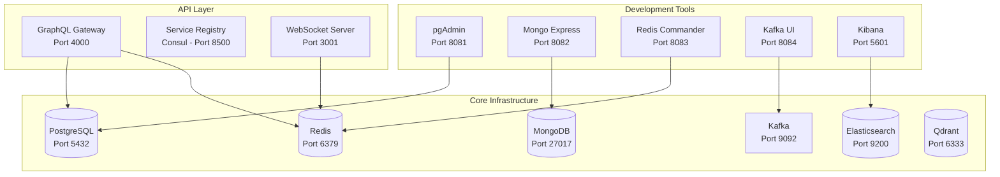

# ERP Suite Infrastructure


Complete infrastructure setup for the ERP Suite development environment with **sequential startup**, **dependency management**, and **cross-platform compatibility**.

## 🚀 Quick Start

### Prerequisites
- **Docker Desktop** (Windows/macOS) or **Docker Engine** (Linux)
- **Docker Compose** v2.0+
- **Make** utility

### Essential Commands

```bash
# Start development infrastructure (recommended)
make start-dev

# Start all services (faster startup)
make start

# Stop all services
make stop

# Reload specific service with dependencies
make reload SERVICE=postgres

# Show logs from all services
make logs

# Show logs from specific service
make logs APP=postgres

# Check service status and health
make services
```

## 🏗️ Infrastructure Services

### Core Services
- **PostgreSQL 15+** - Primary relational database
- **MongoDB 6+** - Document database for analytics
- **Redis 7+** - Cache, sessions, and message queues
- **Kafka** - Event streaming (KRaft mode, no Zookeeper)
- **Elasticsearch 8+** - Full-text search
- **Qdrant** - Vector database for AI features

### API Layer
- **GraphQL Gateway** - Unified API gateway
- **gRPC Registry (Consul)** - Service discovery
- **WebSocket Server** - Real-time communication

### Development Tools
- **pgAdmin** - PostgreSQL management
- **Mongo Express** - MongoDB interface
- **Redis Commander** - Redis browser
- **Kafka UI** - Kafka management
- **Kibana** - Elasticsearch visualization

## 📋 Service Endpoints

| Service | Port | URL | Credentials |
|---------|------|-----|-------------|
| **API Layer** | | | |
| GraphQL Gateway | 4000 | http://localhost:4000/graphql | - |
| GraphQL Playground | 4000 | http://localhost:4000/playground | - |
| gRPC Registry | 8500 | http://localhost:8500 | - |
| WebSocket Server | 3001 | http://localhost:3001 | - |
| **Infrastructure** | | | |
| PostgreSQL | 5432 | localhost:5432 | postgres/postgres |
| MongoDB | 27017 | localhost:27017 | root/password |
| Redis | 6379 | localhost:6379 | password: redispassword |
| Qdrant | 6333 | http://localhost:6333 | - |
| Kafka | 9092 | localhost:9092 | - |
| Elasticsearch | 9200 | http://localhost:9200 | elastic/password |
| **Development Tools** | | | |
| pgAdmin | 8081 | http://localhost:8081 | admin@erp.com/admin |
| Mongo Express | 8082 | http://localhost:8082 | admin/pass |
| Redis Commander | 8083 | http://localhost:8083 | - |
| Kafka UI | 8084 | http://localhost:8084 | - |
| Kibana | 5601 | http://localhost:5601 | elastic/password |

## 🔄 Sequential Startup System

The `start-dev` command uses an **8-phase sequential startup** to reduce resource load and ensure proper dependency management:

### Phase-by-Phase Startup
1. **Phase 1**: Core Databases (PostgreSQL, Redis)
2. **Phase 2**: Document & Vector Stores (MongoDB, Qdrant)
3. **Phase 3**: Message Broker (Kafka)
4. **Phase 4**: Search Engine (Elasticsearch)
5. **Phase 5**: API Layer (GraphQL Gateway, gRPC Registry)
6. **Phase 6**: WebSocket Server
7. **Phase 7**: Logging (Kibana)
8. **Phase 8**: Development Tools

### Benefits
- ✅ **Reduced resource contention** during startup
- ✅ **Proper dependency ordering** ensures stability
- ✅ **Better error isolation** and debugging
- ✅ **Optimized for macOS** Docker performance
- ✅ **Automatic health checks** between phases

## 🌍 Cross-Platform Compatibility

### Supported Operating Systems

#### 🪟 **Windows**
- **Git Bash/WSL**: ✅ Full compatibility
- **PowerShell**: ✅ Works with Docker Desktop
- **Port checking**: Uses `netstat` (native Windows command)

#### 🐧 **Linux**
- **Ubuntu/Debian/CentOS/Arch**: ✅ Full compatibility
- **Port checking**: Multiple fallbacks (`lsof`, `netstat`, `ss`)

#### 🍎 **macOS**
- **Terminal/Zsh**: ✅ Full compatibility + optimizations
- **Port checking**: Uses `lsof` (native macOS command)
- **Special optimizations**: Resource limits and sequential startup

### Cross-Platform Features
- **Automatic OS detection** and command adaptation
- **Universal Docker commands** work identically across platforms
- **Smart port conflict detection** with OS-specific tools
- **Platform-specific troubleshooting** guidance

## 🍎 macOS Optimizations

### Special Commands for macOS
```bash
# Switch to macOS-optimized configuration
make macos-config

# Check Docker performance on macOS
make macos-performance

# Clean up and optimize Docker for macOS
make macos-clean
```

### macOS Performance Tips
- Increase Docker Desktop memory allocation to 4GB+
- Enable 'Use gRPC FUSE for file sharing' in Docker Desktop
- Use `make start-dev` for optimized sequential startup
- Consider using Colima instead of Docker Desktop

## 🔧 Configuration

### Environment Setup
```bash
# Copy and customize environment file
cp .env.example .env

# Edit configuration as needed
vim .env
```

### Key Configuration Options
```bash
# Database passwords
POSTGRES_PASSWORD=postgres
REDIS_PASSWORD=redispassword
ELASTIC_PASSWORD=password

# Service ports
GRAPHQL_GATEWAY_PORT=4000
CONSUL_PORT=8500
WEBSOCKET_PORT=3001

# Feature flags
ENABLE_LOGGING=true
ENABLE_DEV_TOOLS=true
ENABLE_AI_SERVICES=true
```

## 🔄 Service Management

### Dependency-Aware Service Reloading
The `reload` command automatically restarts dependent services:

```bash
# Restart PostgreSQL and its dependents
make reload SERVICE=postgres
# Also restarts: GraphQL Gateway, pgAdmin

# Restart Redis and its dependents  
make reload SERVICE=redis
# Also restarts: GraphQL Gateway, WebSocket Server, Redis Commander

# Restart MongoDB and its dependents
make reload SERVICE=mongodb
# Also restarts: Mongo Express

# Restart Elasticsearch and its dependents
make reload SERVICE=elasticsearch
# Also restarts: Kibana

# Restart Kafka and its dependents
make reload SERVICE=kafka
# Also restarts: Kafka UI
```

### Logging and Monitoring
```bash
# View all service logs
make logs

# View specific service logs
make logs APP=postgres
make logs APP=graphql-gateway
make logs APP=kafka

# Check service status and health
make services
```

## 🏗️ Architecture Overview



## 🚀 Development Workflow

### For New Module Development
```bash
# 1. Start infrastructure
make start-dev

# 2. Check all services are running
make services

# 3. Connect your module to:
# - PostgreSQL: localhost:5432
# - Redis: localhost:6379  
# - Kafka: localhost:9092
# - MongoDB: localhost:27017
# - Elasticsearch: localhost:9200

# 4. Use development tools:
# - pgAdmin: http://localhost:8081
# - GraphQL Playground: http://localhost:4000/playground
```

### For Infrastructure Development
```bash
# Start specific service groups
make start                    # All services
make stop                     # Stop all services

# Monitor and debug
make logs                     # All logs
make logs APP=postgres        # Specific service
make services                 # Status check

# Reload services
make reload SERVICE=redis     # Restart with dependencies
```

## 🔍 Troubleshooting

### Port Conflicts
The system automatically checks for port conflicts before starting:
```bash
# Manual port conflict check
make check-ports

# If conflicts found, kill processes:
# Windows: netstat -ano | findstr :PORT
# macOS/Linux: sudo lsof -ti:PORT | xargs kill -9
```

### Service Health Issues
```bash
# Check service status
make services

# View service logs
make logs APP=service-name

# Restart problematic service
make reload SERVICE=service-name
```

### Docker Issues
```bash
# Clean up Docker resources
make macos-clean              # macOS-specific cleanup
docker system prune -f       # General cleanup
docker compose down -v       # Stop and remove volumes
```

## 📚 Additional Resources

### Configuration Management
- Environment variables in `.env` file
- Service-specific configuration in `config/` directory
- Docker Compose profiles for flexible service management

### Monitoring and Observability
- Service health checks with automatic restarts
- Centralized logging via Docker Compose
- Development tools for database and service management

### Development Support
- Hot reload support for development
- Persistent volumes for data retention
- Network isolation via Docker networks
- Resource limits for optimal performance

---

## 🎯 Summary

This infrastructure provides a **complete, production-ready development environment** with:

- ✅ **Sequential startup** with dependency management
- ✅ **Cross-platform compatibility** (Windows, macOS, Linux)
- ✅ **Simplified commands** (`start-dev`, `start`, `stop`, `reload`, `logs`, `services`)
- ✅ **Automatic health checks** and service monitoring
- ✅ **macOS optimizations** for Docker Desktop performance
- ✅ **Development tools** for database and service management
- ✅ **Event-driven architecture** ready for microservices

**Get started in seconds:**
```bash
make start-dev
```

That's it! Your complete ERP infrastructure is ready for development. 🚀